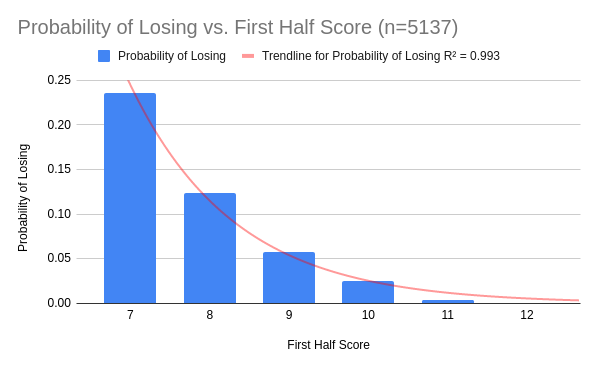

# 93
This is a project seeking to figure out whether the 9-3 curse is real. The 9-3 curse is a superstition in the Valorant community that if you get to a score of 9-3 favourable to you in the first half, you will lose. I am using Joshua Broas' [dataset](https://www.kaggle.com/visualize25/valorant-pro-matches-full-data) to extract match IDs, then using selenium (maybe not the best idea) to scrape vlr.gg for the score timeline.

## Installation
1. `git clone https://github.com/FrankWhoee/93.git`
2. `cd 93`
3. `python3 venv venv` (requires you to have [venv](https://pypi.org/project/virtualenv/) installed)
4. `source venv/bin/activate`
5. `pip install requirements.txt`

## Running
To begin collecting data:
1. `python3 main.py`
2. Data will be saved every 50 matches to data.pickle.

To begin analysis:
1. `python3 analysis.py`

### How to interpret results in data.pickle:
`data.pickle` contains lists of game timelines, where for each game, 1 is a CT win, and -1 is a T win.

## Preliminary results
As of 8:55pm PDT these are the results: 
Sample size: 5137
- Chance of losing from 7-5: 0.23533778767631774
- Chance of losing from 8-4: 0.1242344706911636
- Chance of losing from 9-3: 0.058091286307053944
- Chance of losing from 10-2: 0.025185185185185185
- Chance of losing from 11-1: 0.003367003367003367
- Chance of losing from 12-0: 0.0

## Discussion
The naive interpretation is that there is no 9-3 curse because the probability of losing at 9-3 is not higher than either 8-4 or 7-5, which our preliminary data clearly proves. A more nuanced interpretation would be finding the expected probability of losing given a score of 9-3 is lower than the empirical data.

This graph shows there is no noticeable difference in loss probability at 9-3, and our data fits the trendline pretty well, so the probability of losing a 9-3 game is the same as expected.

All of this data is pulled from pro/semi-pro matches as Valorant lacks a way to collect data en masse for ranked games, so it's possible that the phenomenon felt in ranked doesn't show up in pro/semi-pro settings.

## Credits
Thanks to Joshua Broas for the [dataset](https://www.kaggle.com/visualize25/valorant-pro-matches-full-data).

Work sponsored by SDN. [Join SDN today.](https://joinsdn.com) 

